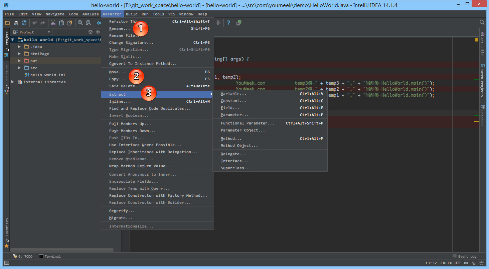
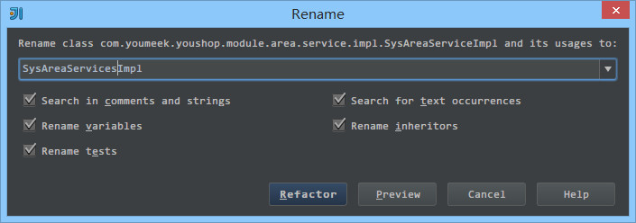

# 重构讲解

## 重构的常用功能介绍

> * 如上图标注所示，IntelliJ IDEA 的重构功能全部都在这个菜单上，所以我们也可以理解为这个菜单就是重构功能的体现，只是有时候我们通过快捷键的方式来加以体现而已。
> * 如上图标注 1 所示，在实际开发中我们经常会对文件进行重命名，这里用的快捷键就是 `Shift + F6`。
> * 如上图标注 2 所示，移动文件到其他包或是目录，我们可以通过快捷键也可以通过拖动对应的文件到其他目录进行重构。
> * 如上图标注 3 所示，提取 Java 类代码也是经常遇到的优化类型的重构，这里不进行一一讲解，大家可以自己尝试下。

> * 当我们要对一个类进行重命名的时候，会弹出该选项，IntelliJ IDEA 会帮我们自动扫描对应勾选项功能的地方进行重命名，这样可以省去我们很多工作。如果担心重构出错，可以点击 `Preview` 进行预览，IntelliJ IDEA 可以提示会修改哪些文件，修改哪一行。同时有一点是 IntelliJ IDEA 比较牛的地方，就是对于类关联的 xml 或是其他资源文件的重构，IntelliJ IDEA 都可以很好地做到识别，所以 IntelliJ IDEA 在开发 Java Web 项目上可以帮我们省去很多苦力活。
> * 所以，如果单论 Java 类上的重构功能，跟其他 IDE 并不会有太明显的优势突出，但是在 Web 方向的重构，目前应该是所有市场上的 IDE 中最好的，包括 HTML、CSS、JavaScript 等相关文件都可以做到一些功能的重构。