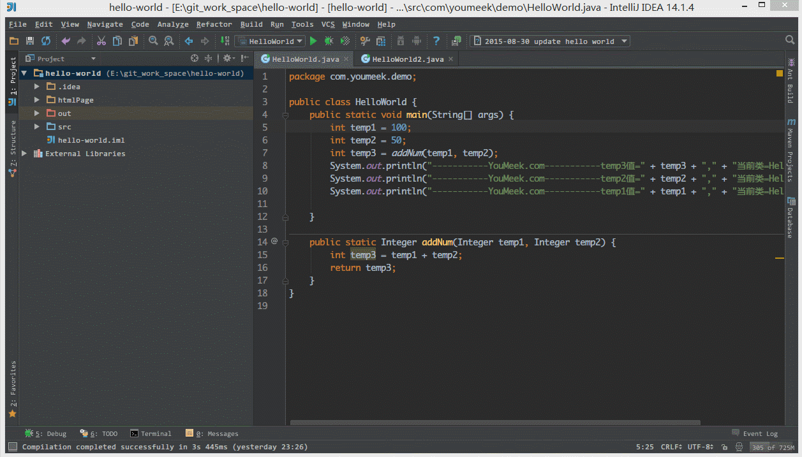
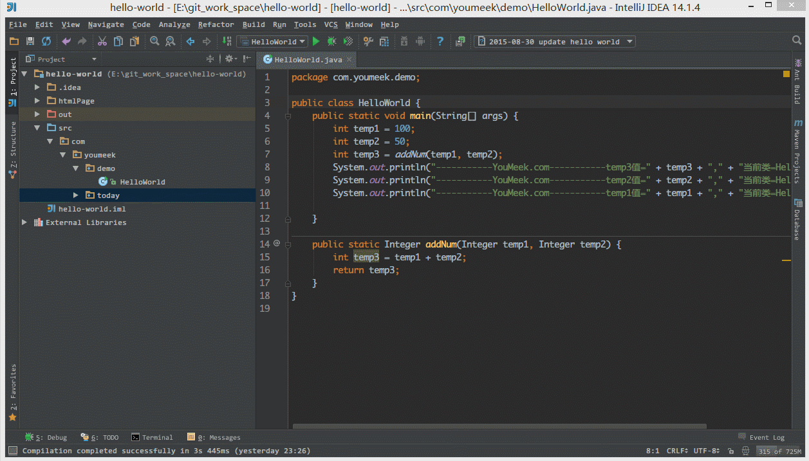
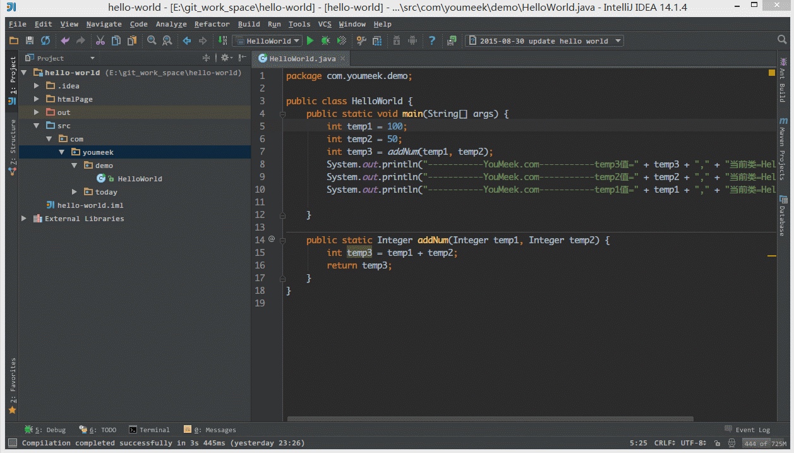
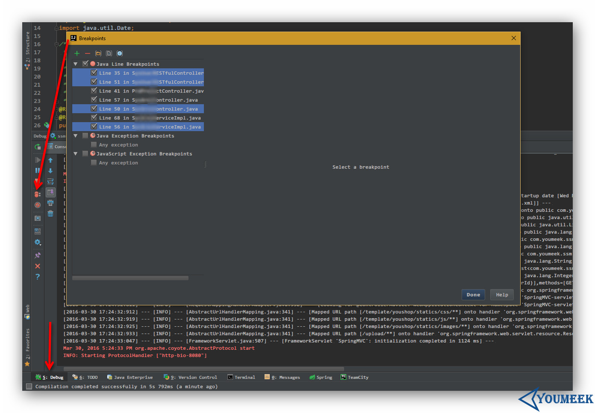
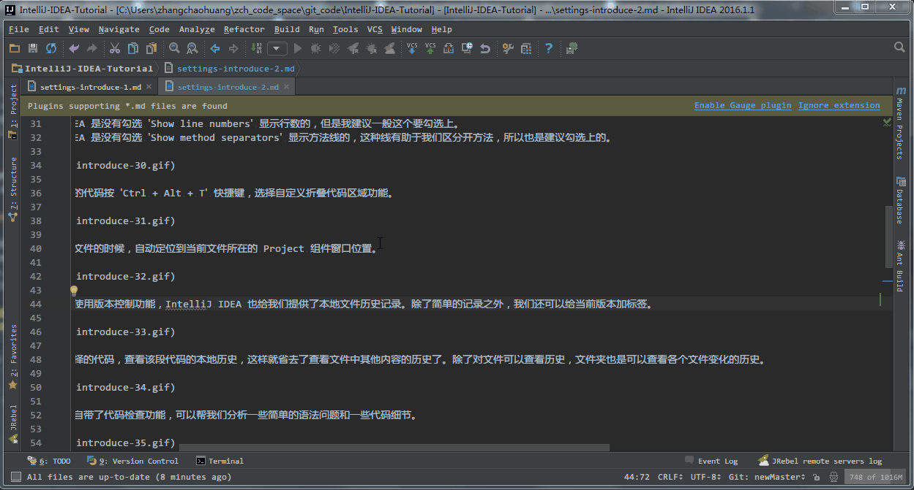
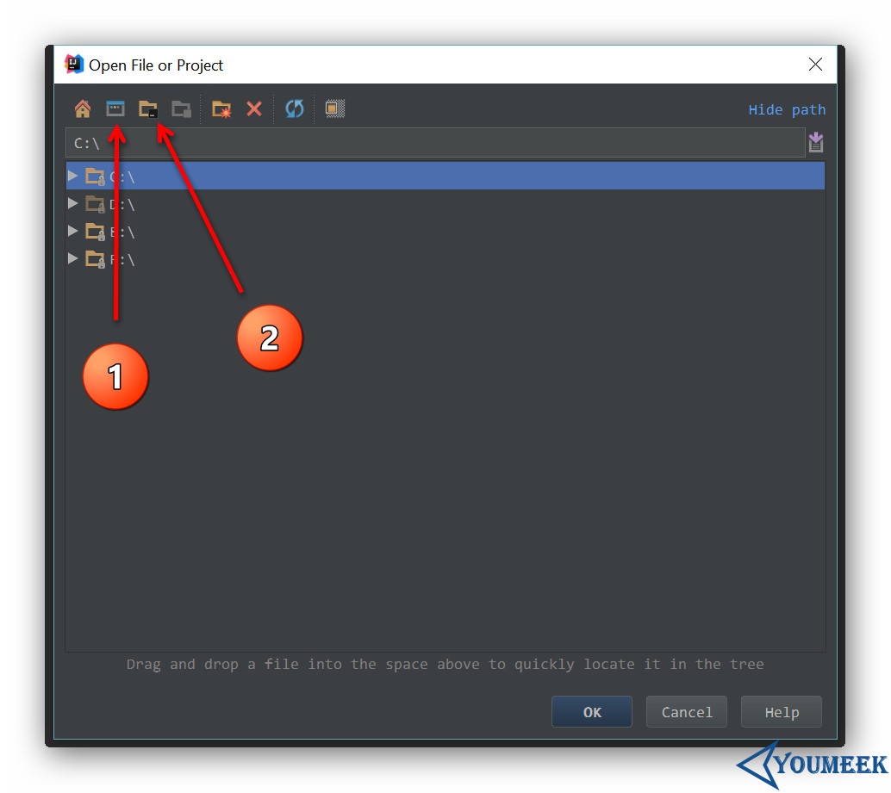
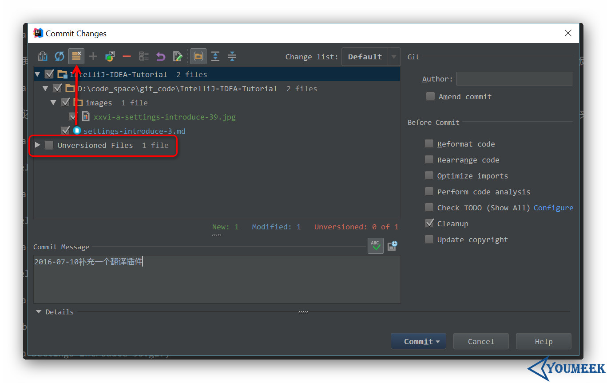

# IntelliJ IDEA 常用设置讲解

## 说明

IntelliJ IDEA 有很多人性化的设置我们必须单独拿出来讲解，也因为这些人性化的设置让我们这些 IntelliJ IDEA 死忠粉更加死心塌地使用它和分享它。

## 常用设置

> * 如上图 Gif 所示，当我们在编辑某个文件的时候，自动定位到当前文件所在的 Project 组件窗口位置。

> * 如上图 Gif 所示，即使我们项目没有使用版本控制功能，IntelliJ IDEA 也给我们提供了本地文件历史记录。除了简单的记录之外，我们还可以给当前版本加标签。

> * 如上图 Gif 所示，我们还可以根据选择的代码，查看该段代码的本地历史，这样就省去了查看文件中其他内容的历史了。除了对文件可以查看历史，文件夹也是可以查看各个文件变化的历史。

> * 如上图 Gif 所示，IntelliJ IDEA 自带了代码检查功能，可以帮我们分析一些简单的语法问题和一些代码细节。

> * 如上图 Gif 所示，IntelliJ IDEA 自带模拟请求工具 Rest Client，在开发时用来模拟请求是非常好用的。

> * 如上图 Gif 所示，IntelliJ IDEA 的自定义 TODO 功能非常好用，强烈建议平时开发要经常使用上。

> * 如上图箭头所示，在 Debug 状态下，如果我们要批量删除断点，可以点击图上箭头所示的按钮，然后选中要删除的断点按断点上面的减号进行删除。

> * 默认 IntelliJ IDEA 是有一套自己的 IDE 整体设置的，比如 IDE 设置中我们常修改的：默认编码、编译版本、Maven 本地库路径等等，这些其实是可以避免的。
> * 按正常设置 Project 流程的话，我们在 Project 状态下进行 IDE 设置，这些设置并不会被当做一个标准的 IDE 设置模板保存起来，所以你下次打开一个新的 Project 还是要重新设置的，为了简便操作，你可以按上图 Gif 所示进行设置 `Default Settings，这样下次打开新的 Project 就会以这个 IDE 设置进行。
> * 需要注意的是：设置好配置之后，你需要重启 IntelliJ IDEA，重启之后的 IntelliJ IDEA 重新打开 Project 才能有效果。

> * 如上图所示，不管是用 IntelliJ IDEA 打开新文件，或是在安装本地插件，在弹出的窗口中，图 1 按钮支持快速定位到系统桌面目录，图 2 按钮支持快速定位到当前项目目录。

> * 2016.2 版本新增箭头指向的按钮，在提交列表里可以显示项目中未加入到版本控制的文件，方便我们在提交的时候做好代码检查，以防漏掉某些文件未提交。

